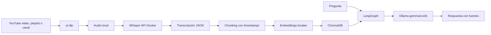

# YouTube Channel RAG Agent

Agente local para convertir videos de YouTube en una base de conocimiento consultable. Puede ingerir un video, una playlist, la pestaña de videos de un canal o los Shorts, transcribir el audio con Whisper, indexar las transcripciones en ChromaDB y responder preguntas con un agente LangGraph usando Ollama.

El proyecto está pensado para trabajar con canales especializados: cursos, podcasts técnicos, canales de investigación, formación interna, entrevistas o cualquier colección de videos donde quieras buscar ideas sin volver a ver horas de contenido.

## Qué Hace

- Transcribe videos de YouTube con Whisper en Docker.
- Funciona en macOS/Windows/Linux en modo CPU.
- Acelera Whisper con CUDA en Windows/Linux con GPU NVIDIA.
- Procesa canales completos usando URLs como `https://www.youtube.com/@CANAL/videos`.
- Guarda transcripciones JSON reutilizables en `data/transcripts`.
- Divide el contenido en chunks con timestamps.
- Indexa los chunks en ChromaDB local.
- Usa embeddings locales con SentenceTransformers por defecto.
- Responde preguntas con LangGraph y Ollama usando `gemma4:e2b`.
- Devuelve fuentes con enlaces al minuto exacto del video.
- Permite relanzar ingestas y saltar videos ya transcritos.

## Stack

| Capa | Tecnología |
| --- | --- |
| Orquestación agente | LangGraph |
| LLM local | Ollama con `gemma4:e2b` |
| Transcripción | faster-whisper |
| Whisper runtime | Docker CPU por defecto; override CUDA opcional |
| Vector DB | ChromaDB local |
| Descarga YouTube | yt-dlp |
| Embeddings | SentenceTransformers local |
| CLI | Python |

## Requisitos

- Windows con PowerShell, Linux o macOS.
- Python 3.10 o superior.
- Docker y Docker Compose.
- Ollama corriendo en local.
- Modelo `gemma4:e2b` disponible en Ollama.

Opcional para transcripción acelerada:

- GPU NVIDIA con CUDA disponible para Docker.

## Instalar Ollama

Si ya tienes Ollama instalado, salta a la comprobación. Si no, instala Ollama desde la página oficial:

- Windows: [ollama.com/download/windows](https://ollama.com/download/windows)
- macOS: [ollama.com/download/mac](https://ollama.com/download/mac)
- Linux: [ollama.com/download/linux](https://ollama.com/download/linux)
- Quickstart oficial: [docs.ollama.com/quickstart](https://docs.ollama.com/quickstart)

En Windows también puedes instalarlo desde PowerShell:

```powershell
irm https://ollama.com/install.ps1 | iex
```

En Linux:

```bash
curl -fsSL https://ollama.com/install.sh | sh
```

Después de instalarlo, asegúrate de que Ollama está corriendo. En Windows/macOS normalmente queda como app en segundo plano. En Linux puedes comprobar el servicio o ejecutar `ollama serve`.

Comprueba que responde:

```powershell
ollama list
```

Descarga el modelo de chat que usa este proyecto:

```powershell
ollama pull gemma4:e2b
```

Comprueba que aparece en la lista:

```powershell
ollama list
```

## Instalación Rápida

### macOS / CPU Compatible

Este modo también sirve para Windows/Linux sin NVIDIA. Es más lento, pero portátil.

```powershell
git clone https://github.com/JotaTerrasa/Youtube-Channel-Local-RAG.git
cd Youtube-Channel-Local-RAG

Copy-Item .env.example .env
docker compose up -d --build

python -m venv .venv
.\.venv\Scripts\Activate.ps1
pip install -e .

yt-agent check
```

En macOS/Linux:

```bash
git clone https://github.com/JotaTerrasa/Youtube-Channel-Local-RAG.git
cd Youtube-Channel-Local-RAG

cp .env.example .env
docker compose up -d --build

python -m venv .venv
source .venv/bin/activate
pip install -e .

yt-agent check
```

### Windows/Linux con NVIDIA CUDA

```powershell
git clone https://github.com/JotaTerrasa/Youtube-Channel-Local-RAG.git
cd Youtube-Channel-Local-RAG

Copy-Item .env.example .env
docker compose -f docker-compose.yml -f docker-compose.cuda.yml up -d --build

python -m venv .venv
.\.venv\Scripts\Activate.ps1
pip install -e .

yt-agent check
```

En Linux con NVIDIA:

```bash
cp .env.example .env
docker compose -f docker-compose.yml -f docker-compose.cuda.yml up -d --build

python -m venv .venv
source .venv/bin/activate
pip install -e .

yt-agent check
```

La primera transcripción descargará el modelo Whisper configurado. En CPU se usa `medium` por defecto para que macOS sea usable. En CUDA se usa `large-v3`.

## Uso

Ingerir un video:

```powershell
yt-agent ingest "https://www.youtube.com/watch?v=VIDEO_ID" --language es
```

Ingerir un canal completo:

```powershell
yt-agent ingest "https://www.youtube.com/@CANAL/videos" --language es
```

Probar primero con pocos videos:

```powershell
yt-agent ingest "https://www.youtube.com/@CANAL/videos" --max-videos 3 --language es
```

Actualizar un canal procesando solo videos nuevos:

```powershell
yt-agent ingest "https://www.youtube.com/@CANAL/videos" --language es --skip-cached
```

Ingerir Shorts:

```powershell
yt-agent ingest "https://www.youtube.com/@CANAL/shorts" --language es
```

Preguntar a la base:

```powershell
yt-agent ask "Qué dice el canal sobre agentes RAG?"
```

Abrir chat interactivo:

```powershell
yt-agent chat
```

Ver cuántos chunks hay indexados:

```powershell
yt-agent stats
```

## Ejemplo de Respuesta

```text
El canal explica que una arquitectura RAG permite consultar conocimiento externo sin reentrenar el modelo...

Fuentes:
[1] Título del video (12:31-13:48) https://www.youtube.com/watch?v=...&t=751s
[2] Otro video (04:10-05:02) https://www.youtube.com/watch?v=...&t=250s
```

## Arquitectura



Más detalle en [docs/ARCHITECTURE.md](docs/ARCHITECTURE.md).

## Estructura

```text
.
├── docker/
│   └── whisper/              # API FastAPI con faster-whisper
│       ├── Dockerfile        # CPU portable, macOS compatible
│       └── Dockerfile.cuda   # NVIDIA CUDA
├── src/
│   └── yt_agent/             # CLI, ingesta, RAG, LangGraph
├── tests/                    # Tests unitarios
├── data/
│   ├── audio/                # Audios descargados, ignorados por Git
│   ├── chroma/               # Persistencia Chroma, ignorada por Git
│   ├── transcripts/          # Transcripciones, ignoradas por Git
│   └── whisper-cache/        # Cache del modelo Whisper, ignorada por Git
├── docker-compose.yml
├── pyproject.toml
└── README.md
```

## Documentación

- [Uso detallado](docs/USAGE.md)
- [Arquitectura](docs/ARCHITECTURE.md)
- [Desarrollo](docs/DEVELOPMENT.md)
- [Troubleshooting](docs/TROUBLESHOOTING.md)

## Configuración

Las variables principales viven en `.env`:

```dotenv
WHISPER_URL=http://localhost:9000
CHROMA_HOST=localhost
CHROMA_PORT=8000
OLLAMA_BASE_URL=http://localhost:11434
OLLAMA_MODEL=gemma4:e2b
CHROMA_COLLECTION=youtube_knowledge
EMBEDDING_PROVIDER=sentence-transformers
EMBEDDING_MODEL=sentence-transformers/paraphrase-multilingual-MiniLM-L12-v2
RETRIEVE_K=6
```

## Embeddings

Por defecto se usa `sentence-transformers/paraphrase-multilingual-MiniLM-L12-v2`, que funciona bien para español e inglés y queda local tras la primera descarga.

`gemma4:e2b` se usa como LLM, no como modelo de embeddings. Si quieres embeddings desde Ollama, instala un modelo compatible:

```powershell
ollama pull nomic-embed-text
```

Y cambia `.env`:

```dotenv
EMBEDDING_PROVIDER=ollama
OLLAMA_EMBED_MODEL=nomic-embed-text
```

## Comandos Útiles

```powershell
yt-agent check
yt-agent stats
docker compose ps
docker compose logs -f whisper
docker compose logs -f chroma
docker compose down
```

Para levantar el modo CUDA:

```powershell
docker compose -f docker-compose.yml -f docker-compose.cuda.yml up -d --build
```

## Notas Legales

Este proyecto descarga y transcribe contenido de YouTube para uso local. Respeta los derechos de autor, los términos de YouTube y las licencias de los creadores. No subas transcripciones, audios o bases vectoriales generadas a un repositorio público salvo que tengas permiso para hacerlo.

## Licencia

MIT. Ver [LICENSE](LICENSE).
