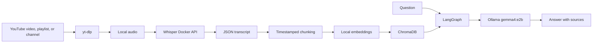
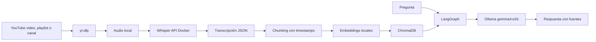

# YouTube Channel RAG Agent

## English

Local agent that turns YouTube videos into a searchable knowledge base. It can ingest a single video, a playlist, a channel videos tab, or Shorts, transcribe the audio with Whisper, index transcripts in ChromaDB, and answer questions with a LangGraph agent using Ollama.

The project is designed for specialized channels: courses, technical podcasts, research channels, internal training, interviews, or any video collection where you want to search ideas without watching hours of content again.

## What It Does

- Transcribes YouTube videos with Whisper in Docker.
- Runs on macOS, Windows, and Linux in CPU mode.
- Accelerates Whisper with CUDA on Windows/Linux with NVIDIA GPUs.
- Processes full channels using URLs like `https://www.youtube.com/@CHANNEL/videos`.
- Stores reusable JSON transcripts in `data/transcripts`.
- Splits content into timestamped chunks.
- Indexes chunks in local ChromaDB.
- Uses local SentenceTransformers embeddings by default.
- Answers questions with LangGraph and Ollama using `gemma4:e2b`.
- Returns sources with links to the exact video timestamp.
- Supports repeated ingestion runs and skips already transcribed videos.

## Stack

| Layer | Technology |
| --- | --- |
| Agent orchestration | LangGraph |
| Local LLM | Ollama with `gemma4:e2b` |
| Transcription | faster-whisper |
| Whisper runtime | Docker CPU by default; optional CUDA override |
| Vector DB | Local ChromaDB |
| YouTube download | yt-dlp |
| Embeddings | Local SentenceTransformers |
| CLI | Python |

## Requirements

- Windows with PowerShell, Linux, or macOS.
- Python 3.10 or higher.
- Docker and Docker Compose.
- Ollama running locally.
- `gemma4:e2b` available in Ollama.

Optional for accelerated transcription:

- NVIDIA GPU with CUDA available to Docker.

## Install Ollama

If you already have Ollama installed, skip to the checks. Otherwise, install Ollama from the official page:

- Windows: [ollama.com/download/windows](https://ollama.com/download/windows)
- macOS: [ollama.com/download/mac](https://ollama.com/download/mac)
- Linux: [ollama.com/download/linux](https://ollama.com/download/linux)
- Official quickstart: [docs.ollama.com/quickstart](https://docs.ollama.com/quickstart)

On Windows you can also install it from PowerShell:

```powershell
irm https://ollama.com/install.ps1 | iex
```

On Linux:

```bash
curl -fsSL https://ollama.com/install.sh | sh
```

After installation, make sure Ollama is running. On Windows/macOS it usually runs as a background app. On Linux you can check the service or run `ollama serve`.

Check that it responds:

```powershell
ollama list
```

Pull the chat model used by this project:

```powershell
ollama pull gemma4:e2b
```

Check that it appears in the list:

```powershell
ollama list
```

## Quick Install

### macOS / CPU Compatible

This mode also works on Windows/Linux without NVIDIA. It is slower, but portable.

```powershell
git clone https://github.com/JotaTerrasa/Youtube-Channel-Local-RAG.git
cd Youtube-Channel-Local-RAG

Copy-Item .env.example .env
docker compose up -d --build

python -m venv .venv
.\.venv\Scripts\Activate.ps1
pip install -e .

yt-agent check
```

On macOS/Linux:

```bash
git clone https://github.com/JotaTerrasa/Youtube-Channel-Local-RAG.git
cd Youtube-Channel-Local-RAG

cp .env.example .env
docker compose up -d --build

python -m venv .venv
source .venv/bin/activate
pip install -e .

yt-agent check
```

### Windows/Linux with NVIDIA CUDA

```powershell
git clone https://github.com/JotaTerrasa/Youtube-Channel-Local-RAG.git
cd Youtube-Channel-Local-RAG

Copy-Item .env.example .env
docker compose -f docker-compose.yml -f docker-compose.cuda.yml up -d --build

python -m venv .venv
.\.venv\Scripts\Activate.ps1
pip install -e .

yt-agent check
```

On Linux with NVIDIA:

```bash
cp .env.example .env
docker compose -f docker-compose.yml -f docker-compose.cuda.yml up -d --build

python -m venv .venv
source .venv/bin/activate
pip install -e .

yt-agent check
```

The first transcription downloads the configured Whisper model. CPU mode uses `medium` by default so macOS remains usable. CUDA mode uses `large-v3`.

## Usage

Ingest one video:

```powershell
yt-agent ingest "https://www.youtube.com/watch?v=VIDEO_ID" --language es
```

Ingest a full channel:

```powershell
yt-agent ingest "https://www.youtube.com/@CHANNEL/videos" --language es
```

Test first with a small number of videos:

```powershell
yt-agent ingest "https://www.youtube.com/@CHANNEL/videos" --max-videos 3 --language es
```

Update a channel by processing only new videos:

```powershell
yt-agent ingest "https://www.youtube.com/@CHANNEL/videos" --language es --skip-cached
```

Ingest Shorts:

```powershell
yt-agent ingest "https://www.youtube.com/@CHANNEL/shorts" --language es
```

Ask the knowledge base:

```powershell
yt-agent ask "What does the channel say about RAG agents?"
```

Open interactive chat:

```powershell
yt-agent chat
```

Show indexed chunk count:

```powershell
yt-agent stats
```

## Example Answer

```text
The channel explains that a RAG architecture allows the model to consult external knowledge without retraining...

Sources:
[1] Video title (12:31-13:48) https://www.youtube.com/watch?v=...&t=751s
[2] Another video (04:10-05:02) https://www.youtube.com/watch?v=...&t=250s
```

## Architecture



More detail in [docs/ARCHITECTURE.md](docs/ARCHITECTURE.md).

## Project Structure

```text
.
├── docker/
│   └── whisper/              # FastAPI service with faster-whisper
│       ├── Dockerfile        # Portable CPU image, macOS compatible
│       └── Dockerfile.cuda   # NVIDIA CUDA image
├── src/
│   └── yt_agent/             # CLI, ingestion, RAG, LangGraph
├── tests/                    # Unit tests
├── data/
│   ├── audio/                # Downloaded audio, ignored by Git
│   ├── chroma/               # Chroma persistence, ignored by Git
│   ├── transcripts/          # Transcripts, ignored by Git
│   └── whisper-cache/        # Whisper/Hugging Face model cache, ignored by Git
├── docker-compose.yml
├── pyproject.toml
└── README.md
```

## Documentation

- [Detailed usage](docs/USAGE.md)
- [Architecture](docs/ARCHITECTURE.md)
- [Development](docs/DEVELOPMENT.md)
- [Troubleshooting](docs/TROUBLESHOOTING.md)

## Technical Decisions

- **Local RAG instead of fine-tuning:** channel knowledge changes often, so updating transcripts and indexes is more practical than retraining a model.
- **Whisper isolated in Docker:** transcription has heavy dependencies and different CPU/CUDA needs; isolating it keeps the agent's Python environment simpler.
- **ChromaDB as local vector store:** prioritizes a simple, persistent, and reproducible setup for personal use or prototypes.
- **Local embeddings by default:** `SentenceTransformers` avoids external APIs and supports Spanish and English content.
- **LangGraph for the RAG flow:** the current graph is intentionally simple, but it separates retrieval and generation so the agent can be extended.
- **Timestamped sources:** every answer should be verifiable against the original video, not only the retrieved text.
- **CPU by default and CUDA optional:** the base mode works on macOS, Windows, and Linux; CUDA is an optimization for NVIDIA machines.

## Configuration

Main variables live in `.env`:

```dotenv
WHISPER_URL=http://localhost:9000
CHROMA_HOST=localhost
CHROMA_PORT=8000
OLLAMA_BASE_URL=http://localhost:11434
OLLAMA_MODEL=gemma4:e2b
CHROMA_COLLECTION=youtube_knowledge
EMBEDDING_PROVIDER=sentence-transformers
EMBEDDING_MODEL=sentence-transformers/paraphrase-multilingual-MiniLM-L12-v2
RETRIEVE_K=6
```

## Embeddings

By default the project uses `sentence-transformers/paraphrase-multilingual-MiniLM-L12-v2`, which works well for Spanish and English and stays local after the first download.

`gemma4:e2b` is used as the LLM, not as an embedding model. If you want embeddings through Ollama, install a compatible model:

```powershell
ollama pull nomic-embed-text
```

And change `.env`:

```dotenv
EMBEDDING_PROVIDER=ollama
OLLAMA_EMBED_MODEL=nomic-embed-text
```

## Useful Commands

```powershell
yt-agent check
yt-agent stats
docker compose ps
docker compose logs -f whisper
docker compose logs -f chroma
docker compose down
```

To start CUDA mode:

```powershell
docker compose -f docker-compose.yml -f docker-compose.cuda.yml up -d --build
```

## Legal Notes

This project downloads and transcribes YouTube content for local use. Respect copyright, YouTube terms, and creators' licenses. Do not upload generated transcripts, audio, or vector databases to a public repository unless you have permission.

## License

MIT. See [LICENSE](LICENSE).

---

## Español

Agente local para convertir videos de YouTube en una base de conocimiento consultable. Puede ingerir un video, una playlist, la pestaña de videos de un canal o los Shorts, transcribir el audio con Whisper, indexar las transcripciones en ChromaDB y responder preguntas con un agente LangGraph usando Ollama.

El proyecto está pensado para trabajar con canales especializados: cursos, podcasts técnicos, canales de investigación, formación interna, entrevistas o cualquier colección de videos donde quieras buscar ideas sin volver a ver horas de contenido.

## Qué Hace

- Transcribe videos de YouTube con Whisper en Docker.
- Funciona en macOS/Windows/Linux en modo CPU.
- Acelera Whisper con CUDA en Windows/Linux con GPU NVIDIA.
- Procesa canales completos usando URLs como `https://www.youtube.com/@CANAL/videos`.
- Guarda transcripciones JSON reutilizables en `data/transcripts`.
- Divide el contenido en chunks con timestamps.
- Indexa los chunks en ChromaDB local.
- Usa embeddings locales con SentenceTransformers por defecto.
- Responde preguntas con LangGraph y Ollama usando `gemma4:e2b`.
- Devuelve fuentes con enlaces al minuto exacto del video.
- Permite relanzar ingestas y saltar videos ya transcritos.

## Stack

| Capa | Tecnología |
| --- | --- |
| Orquestación agente | LangGraph |
| LLM local | Ollama con `gemma4:e2b` |
| Transcripción | faster-whisper |
| Whisper runtime | Docker CPU por defecto; override CUDA opcional |
| Vector DB | ChromaDB local |
| Descarga YouTube | yt-dlp |
| Embeddings | SentenceTransformers local |
| CLI | Python |

## Requisitos

- Windows con PowerShell, Linux o macOS.
- Python 3.10 o superior.
- Docker y Docker Compose.
- Ollama corriendo en local.
- Modelo `gemma4:e2b` disponible en Ollama.

Opcional para transcripción acelerada:

- GPU NVIDIA con CUDA disponible para Docker.

## Instalar Ollama

Si ya tienes Ollama instalado, salta a la comprobación. Si no, instala Ollama desde la página oficial:

- Windows: [ollama.com/download/windows](https://ollama.com/download/windows)
- macOS: [ollama.com/download/mac](https://ollama.com/download/mac)
- Linux: [ollama.com/download/linux](https://ollama.com/download/linux)
- Quickstart oficial: [docs.ollama.com/quickstart](https://docs.ollama.com/quickstart)

En Windows también puedes instalarlo desde PowerShell:

```powershell
irm https://ollama.com/install.ps1 | iex
```

En Linux:

```bash
curl -fsSL https://ollama.com/install.sh | sh
```

Después de instalarlo, asegúrate de que Ollama está corriendo. En Windows/macOS normalmente queda como app en segundo plano. En Linux puedes comprobar el servicio o ejecutar `ollama serve`.

Comprueba que responde:

```powershell
ollama list
```

Descarga el modelo de chat que usa este proyecto:

```powershell
ollama pull gemma4:e2b
```

Comprueba que aparece en la lista:

```powershell
ollama list
```

## Instalación Rápida

### macOS / CPU Compatible

Este modo también sirve para Windows/Linux sin NVIDIA. Es más lento, pero portátil.

```powershell
git clone https://github.com/JotaTerrasa/Youtube-Channel-Local-RAG.git
cd Youtube-Channel-Local-RAG

Copy-Item .env.example .env
docker compose up -d --build

python -m venv .venv
.\.venv\Scripts\Activate.ps1
pip install -e .

yt-agent check
```

En macOS/Linux:

```bash
git clone https://github.com/JotaTerrasa/Youtube-Channel-Local-RAG.git
cd Youtube-Channel-Local-RAG

cp .env.example .env
docker compose up -d --build

python -m venv .venv
source .venv/bin/activate
pip install -e .

yt-agent check
```

### Windows/Linux con NVIDIA CUDA

```powershell
git clone https://github.com/JotaTerrasa/Youtube-Channel-Local-RAG.git
cd Youtube-Channel-Local-RAG

Copy-Item .env.example .env
docker compose -f docker-compose.yml -f docker-compose.cuda.yml up -d --build

python -m venv .venv
.\.venv\Scripts\Activate.ps1
pip install -e .

yt-agent check
```

En Linux con NVIDIA:

```bash
cp .env.example .env
docker compose -f docker-compose.yml -f docker-compose.cuda.yml up -d --build

python -m venv .venv
source .venv/bin/activate
pip install -e .

yt-agent check
```

La primera transcripción descargará el modelo Whisper configurado. En CPU se usa `medium` por defecto para que macOS sea usable. En CUDA se usa `large-v3`.

## Uso

Ingerir un video:

```powershell
yt-agent ingest "https://www.youtube.com/watch?v=VIDEO_ID" --language es
```

Ingerir un canal completo:

```powershell
yt-agent ingest "https://www.youtube.com/@CANAL/videos" --language es
```

Probar primero con pocos videos:

```powershell
yt-agent ingest "https://www.youtube.com/@CANAL/videos" --max-videos 3 --language es
```

Actualizar un canal procesando solo videos nuevos:

```powershell
yt-agent ingest "https://www.youtube.com/@CANAL/videos" --language es --skip-cached
```

Ingerir Shorts:

```powershell
yt-agent ingest "https://www.youtube.com/@CANAL/shorts" --language es
```

Preguntar a la base:

```powershell
yt-agent ask "Qué dice el canal sobre agentes RAG?"
```

Abrir chat interactivo:

```powershell
yt-agent chat
```

Ver cuántos chunks hay indexados:

```powershell
yt-agent stats
```

## Ejemplo de Respuesta

```text
El canal explica que una arquitectura RAG permite consultar conocimiento externo sin reentrenar el modelo...

Fuentes:
[1] Título del video (12:31-13:48) https://www.youtube.com/watch?v=...&t=751s
[2] Otro video (04:10-05:02) https://www.youtube.com/watch?v=...&t=250s
```

## Arquitectura



Más detalle en [docs/ARCHITECTURE.md](docs/ARCHITECTURE.md).

## Estructura

```text
.
├── docker/
│   └── whisper/              # API FastAPI con faster-whisper
│       ├── Dockerfile        # CPU portable, macOS compatible
│       └── Dockerfile.cuda   # NVIDIA CUDA
├── src/
│   └── yt_agent/             # CLI, ingesta, RAG, LangGraph
├── tests/                    # Tests unitarios
├── data/
│   ├── audio/                # Audios descargados, ignorados por Git
│   ├── chroma/               # Persistencia Chroma, ignorada por Git
│   ├── transcripts/          # Transcripciones, ignoradas por Git
│   └── whisper-cache/        # Cache del modelo Whisper/Hugging Face, ignorada por Git
├── docker-compose.yml
├── pyproject.toml
└── README.md
```

## Documentación

- [Uso detallado](docs/USAGE.md)
- [Arquitectura](docs/ARCHITECTURE.md)
- [Desarrollo](docs/DEVELOPMENT.md)
- [Troubleshooting](docs/TROUBLESHOOTING.md)

## Decisiones Técnicas

- **RAG local en vez de fine-tuning:** el conocimiento de un canal cambia con frecuencia, así que es más práctico actualizar transcripciones e índices que reentrenar un modelo.
- **Whisper separado en Docker:** la transcripción tiene dependencias pesadas y distintas necesidades de CPU/CUDA; aislarla permite mantener el entorno Python del agente más simple.
- **ChromaDB como vector store local:** prioriza una configuración sencilla, persistente y reproducible para uso personal o prototipos sin servicios externos.
- **Embeddings locales por defecto:** `SentenceTransformers` evita depender de APIs externas y permite trabajar con contenido en español e inglés.
- **LangGraph para el flujo RAG:** aunque el grafo actual es deliberadamente simple, separa recuperación y generación para poder extender el agente con más pasos.
- **Fuentes con timestamps:** cada respuesta debe poder verificarse contra el video original, no solo contra el texto recuperado.
- **CPU por defecto y CUDA opcional:** el modo base funciona en macOS, Windows y Linux; CUDA queda como optimización para equipos con NVIDIA.

## Configuración

Las variables principales viven en `.env`:

```dotenv
WHISPER_URL=http://localhost:9000
CHROMA_HOST=localhost
CHROMA_PORT=8000
OLLAMA_BASE_URL=http://localhost:11434
OLLAMA_MODEL=gemma4:e2b
CHROMA_COLLECTION=youtube_knowledge
EMBEDDING_PROVIDER=sentence-transformers
EMBEDDING_MODEL=sentence-transformers/paraphrase-multilingual-MiniLM-L12-v2
RETRIEVE_K=6
```

## Embeddings

Por defecto se usa `sentence-transformers/paraphrase-multilingual-MiniLM-L12-v2`, que funciona bien para español e inglés y queda local tras la primera descarga.

`gemma4:e2b` se usa como LLM, no como modelo de embeddings. Si quieres embeddings desde Ollama, instala un modelo compatible:

```powershell
ollama pull nomic-embed-text
```

Y cambia `.env`:

```dotenv
EMBEDDING_PROVIDER=ollama
OLLAMA_EMBED_MODEL=nomic-embed-text
```

## Comandos Útiles

```powershell
yt-agent check
yt-agent stats
docker compose ps
docker compose logs -f whisper
docker compose logs -f chroma
docker compose down
```

Para levantar el modo CUDA:

```powershell
docker compose -f docker-compose.yml -f docker-compose.cuda.yml up -d --build
```

## Notas Legales

Este proyecto descarga y transcribe contenido de YouTube para uso local. Respeta los derechos de autor, los términos de YouTube y las licencias de los creadores. No subas transcripciones, audios o bases vectoriales generadas a un repositorio público salvo que tengas permiso para hacerlo.

## Licencia

MIT. Ver [LICENSE](LICENSE).
