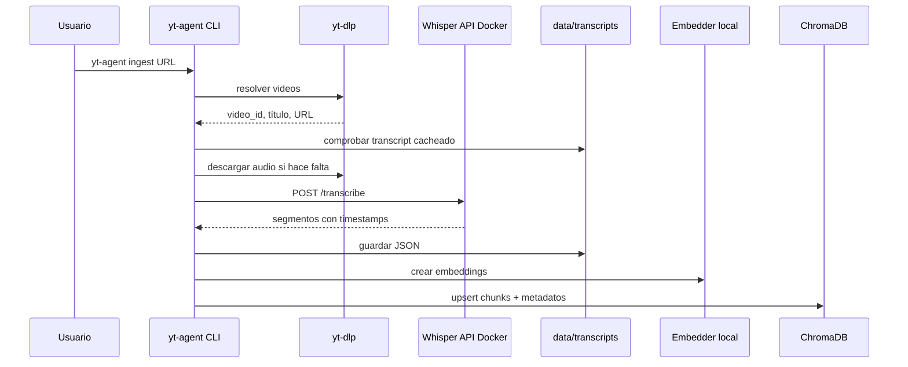
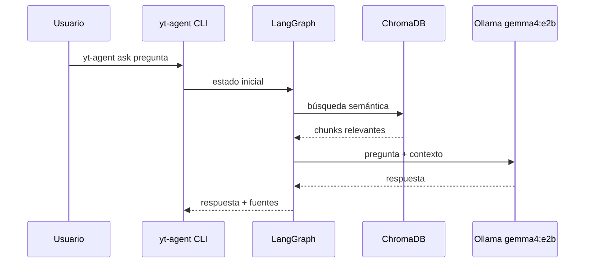

# Arquitectura

El proyecto implementa un RAG local con una capa de agente. El LLM no se entrena con los videos: las transcripciones se convierten en documentos recuperables y el agente consulta esos documentos antes de responder.

## Flujo de Ingesta



## Flujo de Pregunta



## Componentes

### `docker/whisper`

Servicio FastAPI que expone:

- `GET /health`
- `POST /transcribe`

Tiene dos Dockerfiles:

- `Dockerfile`: CPU portable, compatible con macOS/Windows/Linux.
- `Dockerfile.cuda`: NVIDIA CUDA para Windows/Linux con GPU compatible.

Internamente usa `faster-whisper`. El Compose base es CPU y multiplataforma:

- `WHISPER_MODEL=medium`
- `WHISPER_DEVICE=cpu`
- `WHISPER_COMPUTE_TYPE=int8`

El override CUDA para Windows/Linux con NVIDIA usa:

- `WHISPER_MODEL=large-v3`
- `WHISPER_DEVICE=cuda`
- `WHISPER_COMPUTE_TYPE=float16`

### `src/yt_agent/youtube.py`

Resuelve URLs y descarga audio con `yt-dlp`. Para canales usa metadatos planos cuando puede, evitando descargar cada video solo para saber su `video_id`.

### `src/yt_agent/pipeline.py`

Coordina la ingesta:

1. Resolver videos.
2. Comprobar transcripción cacheada.
3. Descargar audio si hace falta.
4. Transcribir.
5. Guardar JSON.
6. Crear chunks.
7. Insertar en Chroma.

### `src/yt_agent/chunking.py`

Crea chunks temporales con:

- texto compacto,
- `video_id`,
- título,
- canal,
- inicio y fin,
- URL al timestamp.

### `src/yt_agent/vectorstore.py`

Cliente de ChromaDB usando embeddings calculados fuera de Chroma. La colección usa distancia coseno.

### `src/yt_agent/graph.py`

Grafo LangGraph simple:

```text
retrieve -> answer -> END
```

El nodo `retrieve` consulta Chroma. El nodo `answer` llama a Ollama con contexto y exige citas tipo `[1]`.

## Datos Locales

```text
data/audio/          audios descargados
data/transcripts/    JSON de transcripciones
data/chroma/         persistencia Chroma
data/whisper-cache/  cache de modelos Whisper/Hugging Face
```

Todo `data/` está pensado para uso local y se ignora en Git salvo `.gitkeep`.

## Decisiones de Diseño

- RAG en vez de fine-tuning: permite actualizar el canal sin reentrenar.
- Whisper en Docker: separa las dependencias de transcripcion del entorno Python local.
- Compose base CPU para macOS/Windows/Linux y override CUDA para NVIDIA.
- Chroma local: simple para desarrollo y uso personal.
- Embeddings locales: no requieren API externa ni otro modelo Ollama.
- Fuentes con timestamps: la respuesta es verificable.
