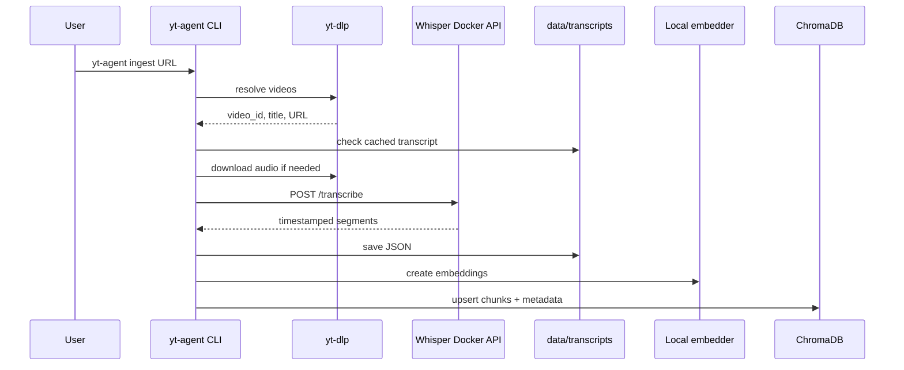
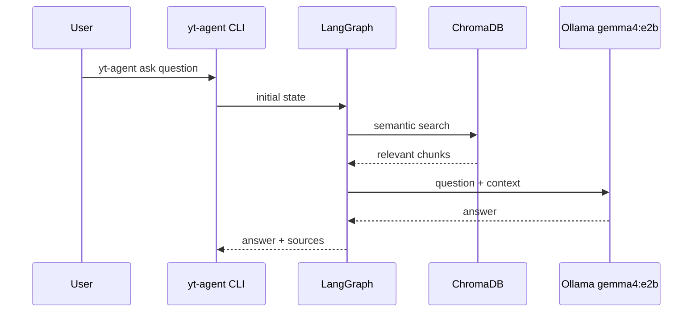
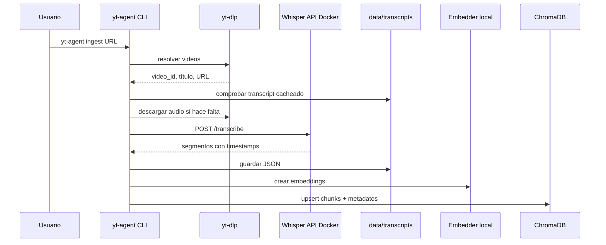
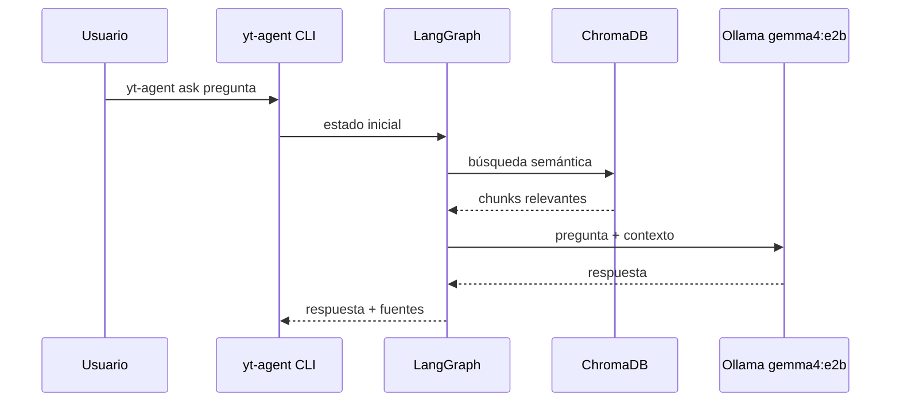

# Architecture

## English

The project implements a local RAG system with an agent layer. The LLM is not trained on the videos: transcripts are converted into retrievable documents and the agent queries those documents before answering.

## Ingestion Flow



## Question Flow



## Components

### `docker/whisper`

FastAPI service that exposes:

- `GET /health`
- `POST /transcribe`

It has two Dockerfiles:

- `Dockerfile`: portable CPU image compatible with macOS/Windows/Linux.
- `Dockerfile.cuda`: NVIDIA CUDA image for Windows/Linux with a compatible GPU.

Internally it uses `faster-whisper`. The base Compose setup is CPU and cross-platform:

- `WHISPER_MODEL=medium`
- `WHISPER_DEVICE=cpu`
- `WHISPER_COMPUTE_TYPE=int8`

The CUDA override for Windows/Linux with NVIDIA uses:

- `WHISPER_MODEL=large-v3`
- `WHISPER_DEVICE=cuda`
- `WHISPER_COMPUTE_TYPE=float16`

### `src/yt_agent/youtube.py`

Resolves URLs and downloads audio with `yt-dlp`. For channels, it uses flat metadata when possible, avoiding a full download just to discover each `video_id`.

### `src/yt_agent/pipeline.py`

Coordinates ingestion:

1. Resolve videos.
2. Check cached transcript.
3. Download audio if needed.
4. Transcribe.
5. Save JSON.
6. Build chunks.
7. Insert into Chroma.

### `src/yt_agent/chunking.py`

Creates timestamped chunks with:

- compact text,
- `video_id`,
- title,
- channel,
- start and end,
- timestamp URL.

### `src/yt_agent/vectorstore.py`

ChromaDB client using embeddings calculated outside Chroma. The collection uses cosine distance.

### `src/yt_agent/graph.py`

Simple LangGraph graph:

```text
retrieve -> answer -> END
```

The `retrieve` node queries Chroma. The `answer` node calls Ollama with context and asks for citations like `[1]`.

## Local Data

```text
data/audio/          downloaded audio
data/transcripts/    JSON transcripts
data/chroma/         Chroma persistence
data/whisper-cache/  Whisper/Hugging Face model cache
```

All `data/` content is intended for local use and is ignored by Git except for `.gitkeep` files.

## Design Decisions

- RAG instead of fine-tuning: the channel can be updated without retraining.
- Whisper in Docker: separates transcription dependencies from the local Python agent environment.
- CPU base Compose for macOS/Windows/Linux and CUDA override for NVIDIA.
- Local Chroma: simple for development and personal use.
- Local embeddings: no external API or extra Ollama embedding model required.
- Timestamped sources: answers are verifiable.

---

## Español

El proyecto implementa un RAG local con una capa de agente. El LLM no se entrena con los videos: las transcripciones se convierten en documentos recuperables y el agente consulta esos documentos antes de responder.

## Flujo de Ingesta



## Flujo de Pregunta



## Componentes

### `docker/whisper`

Servicio FastAPI que expone:

- `GET /health`
- `POST /transcribe`

Tiene dos Dockerfiles:

- `Dockerfile`: CPU portable, compatible con macOS/Windows/Linux.
- `Dockerfile.cuda`: NVIDIA CUDA para Windows/Linux con GPU compatible.

Internamente usa `faster-whisper`. El Compose base es CPU y multiplataforma:

- `WHISPER_MODEL=medium`
- `WHISPER_DEVICE=cpu`
- `WHISPER_COMPUTE_TYPE=int8`

El override CUDA para Windows/Linux con NVIDIA usa:

- `WHISPER_MODEL=large-v3`
- `WHISPER_DEVICE=cuda`
- `WHISPER_COMPUTE_TYPE=float16`

### `src/yt_agent/youtube.py`

Resuelve URLs y descarga audio con `yt-dlp`. Para canales usa metadatos planos cuando puede, evitando descargar cada video solo para saber su `video_id`.

### `src/yt_agent/pipeline.py`

Coordina la ingesta:

1. Resolver videos.
2. Comprobar transcripción cacheada.
3. Descargar audio si hace falta.
4. Transcribir.
5. Guardar JSON.
6. Crear chunks.
7. Insertar en Chroma.

### `src/yt_agent/chunking.py`

Crea chunks temporales con:

- texto compacto,
- `video_id`,
- título,
- canal,
- inicio y fin,
- URL al timestamp.

### `src/yt_agent/vectorstore.py`

Cliente de ChromaDB usando embeddings calculados fuera de Chroma. La colección usa distancia coseno.

### `src/yt_agent/graph.py`

Grafo LangGraph simple:

```text
retrieve -> answer -> END
```

El nodo `retrieve` consulta Chroma. El nodo `answer` llama a Ollama con contexto y exige citas tipo `[1]`.

## Datos Locales

```text
data/audio/          audios descargados
data/transcripts/    JSON de transcripciones
data/chroma/         persistencia Chroma
data/whisper-cache/  cache de modelos Whisper/Hugging Face
```

Todo `data/` está pensado para uso local y se ignora en Git salvo `.gitkeep`.

## Decisiones de Diseño

- RAG en vez de fine-tuning: permite actualizar el canal sin reentrenar.
- Whisper en Docker: separa las dependencias de transcripción del entorno Python local.
- Compose base CPU para macOS/Windows/Linux y override CUDA para NVIDIA.
- Chroma local: simple para desarrollo y uso personal.
- Embeddings locales: no requieren API externa ni otro modelo Ollama.
- Fuentes con timestamps: la respuesta es verificable.
